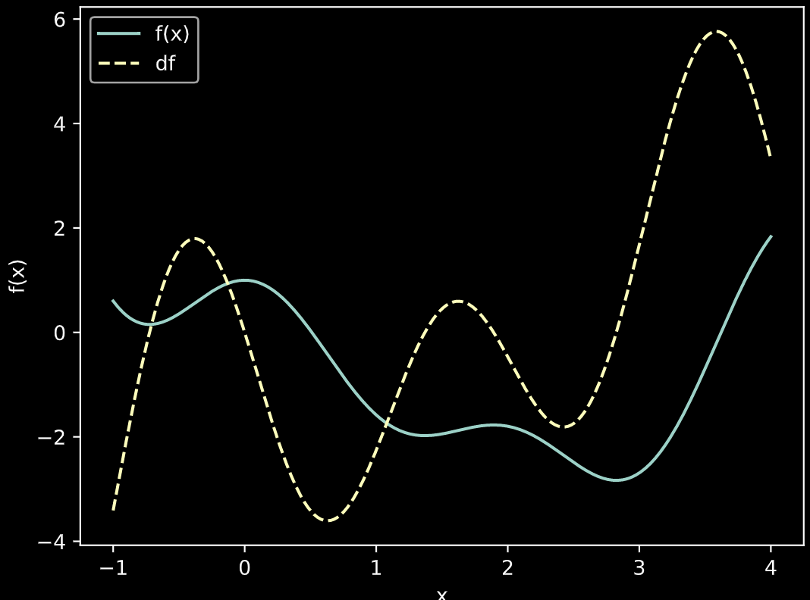
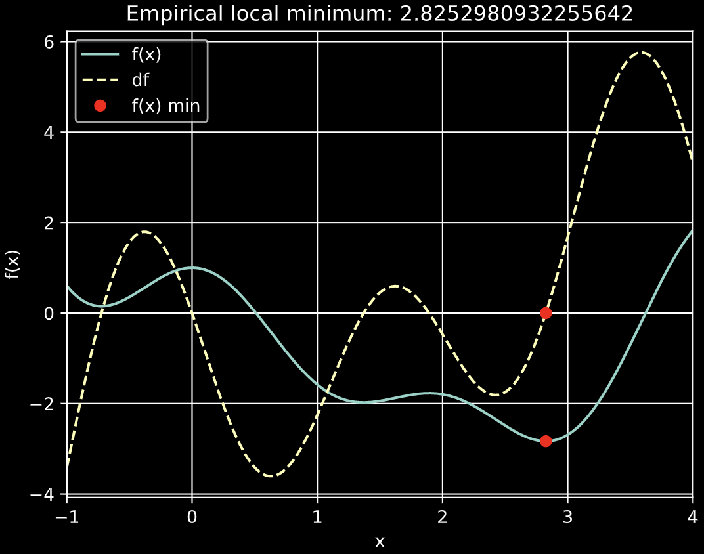
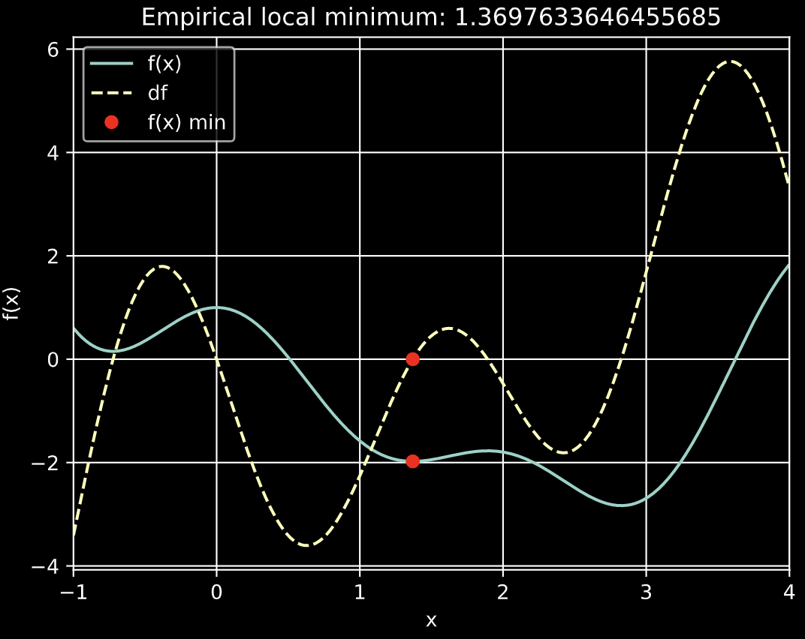
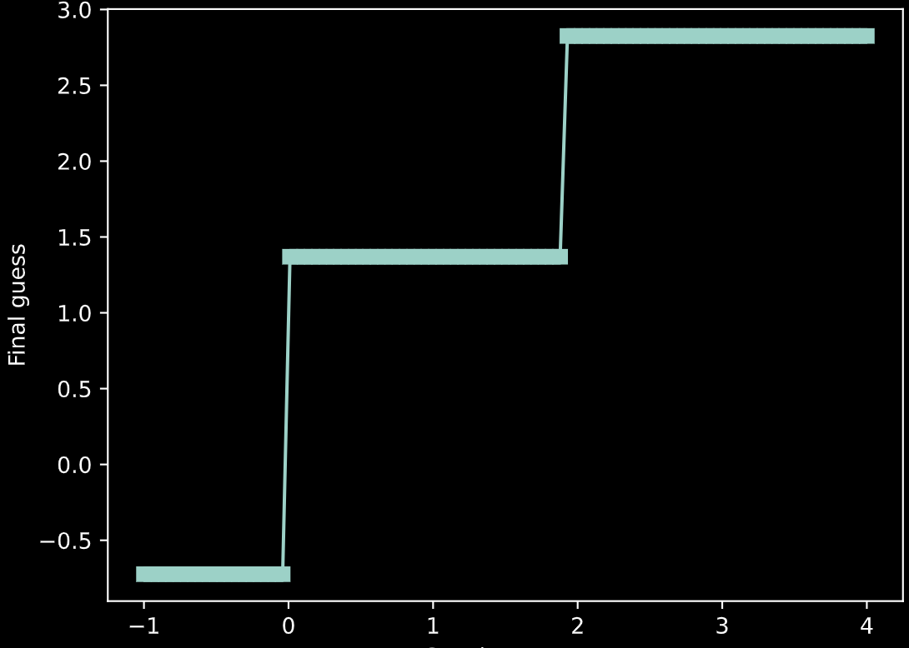
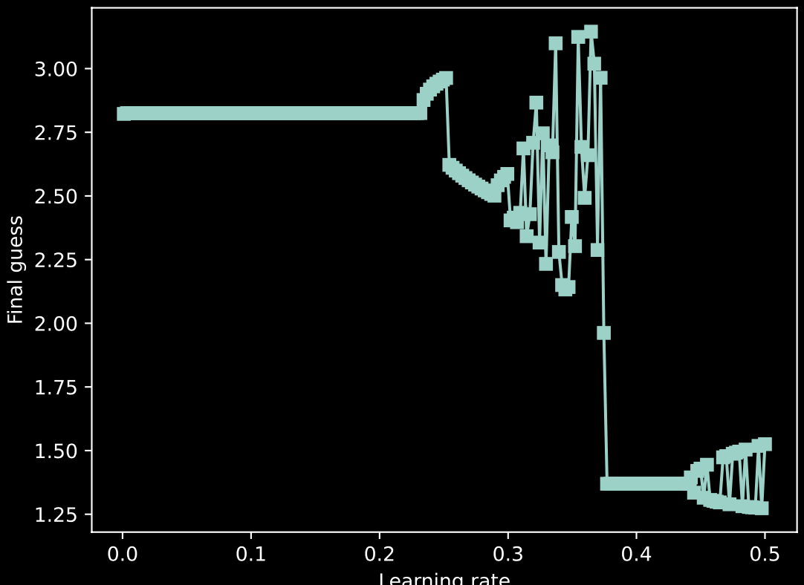
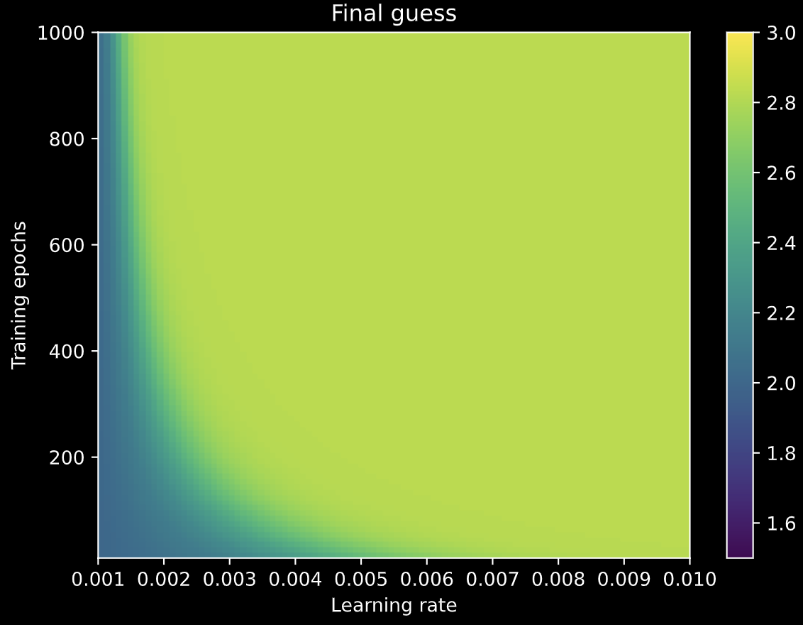
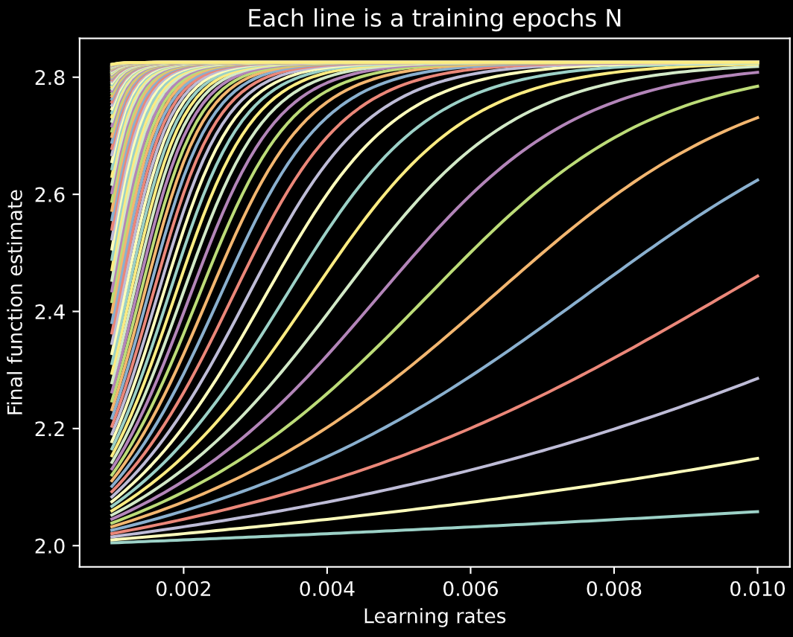
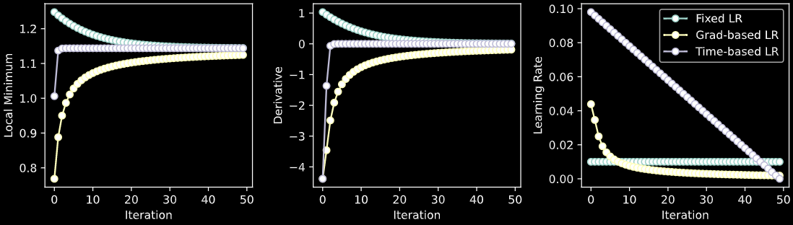
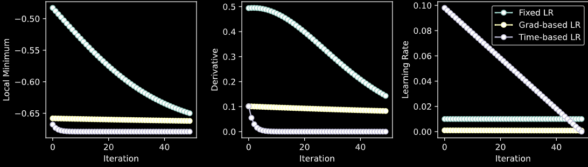
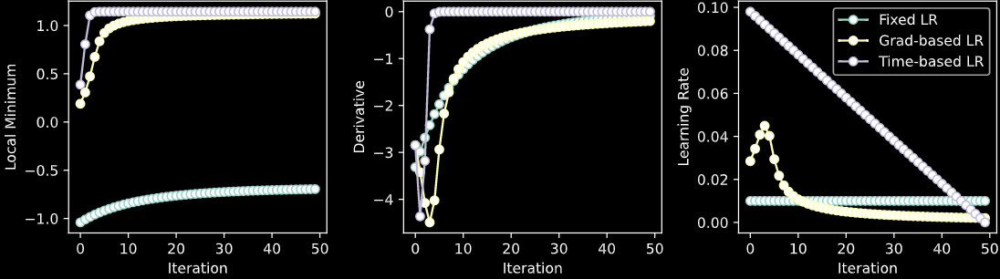

# SEP 740 Assignment 1 Report
## 1. Introduction
 本实验让我深入的学习了梯度下降在深度学习中的应用，它从函数和其导数为出发点，随机取一个起始点x1，然后根据梯度下降的公式(往在x1点导数的反方向更新x1)，不断的迭代，直到找到最小值。这让我知道了梯度下降的原理，以及学习率、training_epochsfixed_learning_params、gradient_learning_params、time_learning_params等概念。在这个过程中，我学习了如何使用python来实现梯度下降算法，以及如何使用matplotlib来绘制图像。我也遇到了很多问题，但是通过不断的尝试，我最终解决了这些问题，完成了这个实验。


## 2. part 1
### 2.1 自定义函数
根据实验要求，我选择了如下的自定义函数：
这个自定义函数的数学表达式如下：
\[f(x) = \sin(2x) + \cos(3x) + 0.5x^2 - 2x\]

这个函数是一个组合函数，包含了正弦、余弦、二次项和线性项，因此它具有振荡性和曲线特征。函数 \(f(x)\) 的导数 \(f'(x)\)：

\[f'(x) = 2\cos(2x) - 3\sin(3x) + x - 2\]
具体的代码如下：
```python
import numpy as np
# 自定义函数 f(x)
def custom_function(x):
    return np.sin(2 * x) + np.cos(3 * x) + 0.5 * x**2 - 2 * x

# 计算 f(x) 的导数 f'(x)
def custom_derivative(x):
    return 2 * np.cos(2 * x) - 3 * np.sin(3 * x) + x - 2

```

观察整体函数的图像后，我取x=-1到x=4这个区间，函数图像如下：

<p align="center"></p>


### 2.2 梯度下降算法
下面是梯度下降算法的伪代码：
```python
# Run through training
for i in range(training_epochs):
    grad = custom_derivative(localmin)
    localmin = localmin - learning_rate * grad
```
其中：
- training_epochs: 迭代次数
- localmin: 起始点
- learning_rate: 学习率
- custom_derivative: 自定义函数的导数，用于计算梯度，localmin会沿着梯度的反方向更新，具体的更新公式就是：\(localmin = localmin - learning_rate * grad\)


 ### 2.3 实验过程和结果
#### 2.3.1 随机选择一个起始点
每次实验都会随机选择一个起始点，这个起始点的范围是[-1, 4]，最开始学习率和training epachs是固定的，有上门的函数图像可知函数的会有一些局部凹点，导致在起始点不一样时，最终的结果也不一样，因此我进行了多次实验，得到了如下的结果：

<div style="display: flex; justify-content: center;">
    
    
</div>

由此引入了从-1到4取依次等距离的取100个数，得到了如下的结果，可以看到不同的起始点区间，最后梯度下降算法找到的最小值会不一样：

<p align="center"></p>

#### 2.3.2 不同的学习率和不同的迭代次数的实验
从上面的实验可以看出起始值为2时，最后比较容易收敛到最小值，下面是不同的学习率的影响，我取了0.001到0.5的学习率，依次取200个点，得到了如下的结果：

<p align="center"></p>

可以看到，学习率越大，最后的结果越不稳定，因为学习率越大，梯度下降的步长越大，有可能会跳过最小值，导致最后的结果不稳定。

然后是结合不同的迭代次数，我取了10到1000的迭代次数，依次取100个点，得到了如下的结果：

<p align="center"></p>

这里不同的颜色代表梯度下降最后的结果，x轴表示不同的学习率，y轴表示不同的training epochs，左下角可以看到，学习率小迭代次数小的时候，最后的结果会呈现一个没有收敛到最小值的情况；从右上部分可以看出，在学习率和迭代次数都满足一定大小后，最后都收敛到了局部最小值。

<p align="center"></p>

从上图可以看出，在我选定的2位起始值时，学习率越小，迭代次数越大，最后收敛到最小值的概率越大。

## 3. part 2
### 3.1 自定义函数
我选定的自定义函数的数学表达式如下：
\[f(x) = \cos(3x) + 0.5x^2 - 2x\]
这个函数是一个组合函数，包含了余弦、二次项和线性项，因此它具有振荡性和曲线特征。函数 \(f(x)\) 的导数 \(f'(x)\)：

\[f'(x) = 2\cos(2x) - 3\sin(3x) + x - 2\]
具体的代码如下：
```python
import numpy as np
# 自定义函数 f(x)
def custom_function(x):
    return np.cos(3 * x) + 0.5 * x**2 - 2 * x

# 计算 f(x) 的导数 f'(x)
def custom_derivative(x):
    return - 3 * np.sin(3 * x) + x - 2

```

### 3.2 不断变化的学习率
part2尝试了在训练过程中持续调整学习率，有两种调整方法，一种是根据梯度值的大小来调整学习率，另一种是根据训练次数来调整学习率，具体的代码如下：
```python
fixed_learning_rate = 0.01
lr = fixed_learning_rate * np.abs(gradient)

time_based_learning_rate = 0.1
lr = time_based_learning_rate * (1 - (i + 1) / training_epochs_time)

```
最后与固定学习率进行了对比，得到如下实验结果：

<p align="center"></p>




需要说明的是，固定学习率的起始值和另外两个的是不一样的。

可以看到随着梯度下降变化的学习率的情况，随着梯度的绝对值的减小，学习率也在不断的减小，这样可以让梯度下降的步长越来越小，收敛到接近最小值时会越来越缓慢或者说精细，这样在当前的情况下可以让梯度下降更加的稳定，不会跳过最小值。

另外可以看到随着训练次数增加学习率不断减小的情况下，最后的结果也应该是比较稳定的，这是因为训练次数增加，梯度的绝对值也会减小，因此学习率也会减小。但是目前这个例子的初始值和学习率的起始值不是很合适，梯度下降很快就收敛了。

## 4. part 3
### 4.1 遇到的挑战
在part1中，我遇到了在我选定了我自己的自定义函数时，我没有根据新函数的特征设置x_range的范围，导致后面的各个实验不好观察。另外在不同学习率和训练epochs实验中，没有设置好热力图的vmin和vmax，导致热力图的颜色不好观察。在根据梯度下降结果的范围设置后，热力图的颜色就很好观察了。

自定义函数的选择上，需要选择一个具有振荡性和曲线特征的函数，这样可以更好的观察梯度下降的过程，因此我选择了一个组合函数，包含了余弦、二次项和线性项，因此它具有振荡性和曲线特征。由于有振荡性，函数很容易收敛到一个局部最小值，每次起始值不同时，最后的结果也不一样，因此我进行了多次实验。

### 4.2 团队合作

我们都完成了自己的实验，选定了自己的自定义函数。我们都是在选定函数后，没有调整显示范围，导致后面的实验不好观察，后来我们都调整了显示范围，使得后面的实验更加的清晰。对于实验结果，我们都进行了分析，得出的结论一致。